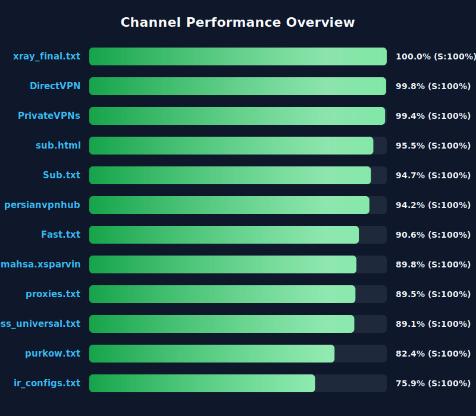

[](https://github.com/4n0nymou3/multi-proxy-config-fetcher/stargazers)
[](https://github.com/4n0nymou3/multi-proxy-config-fetcher/network/members)
[](https://github.com/4n0nymou3/multi-proxy-config-fetcher/issues)
[](https://github.com/4n0nymou3/multi-proxy-config-fetcher/blob/main/LICENSE)
[](https://github.com/4n0nymou3/multi-proxy-config-fetcher/commits)

<div dir="ltr">

# Multi Proxy Config Fetcher

[**🇺🇸English**](README.md) | [**فارسی**](README_FA.md) | [**🇨🇳中文**](README_CN.md) | [**🇷🇺Русский**](README_RU.md)

Продвинутая автоматизированная система управления конфигурациями прокси, которая собирает, проверяет, тестирует, обогащает и фильтрует конфигурации прокси из нескольких источников. Проект предоставляет корпоративное управление прокси с мониторингом состояния в реальном времени, геотегированием и многоступенчатой фильтрацией безопасности.

## 🌐 Доступ к конфигурациям

Все конфигурации прокси и конечные точки доступны через наш унифицированный веб-интерфейс:

### **[👉 Anonymous Proxy Hub - доступ ко всем конечным точкам](https://4n0nymou3.github.io/Anonymous-Proxy-Hub/)**

Веб-интерфейс предоставляет:
- **7 различных конечных точек** для разных сценариев использования
- **Сырые конфигурации** — неотфильтрованные оригинальные конфиги
- **Проверено Xray** — конфигурации, проверенные ядром Xray (Этап 1)
- **Xray с балансировкой нагрузки** — умные JSON-конфиги с балансировкой нагрузки
- **Xray Secure** — конфигурации с повышенной безопасностью
- **Sing-box All** — все конфигурации в формате Sing-box
- **Sing-box Tested** — конфигурации, проверенные Sing-box (Этап 2)
- **Sing-box Secure** — максимально безопасные конфигурации Sing-box
- **Clash All** — все конфигурации в формате Clash/Mihomo
- **Clash Tested** — протестированные конфигурации Clash
- **Clash Secure** — максимально безопасные конфигурации Clash

## 📊 Мониторинг производительности источников

Статистика производительности в реальном времени для всех настроенных источников (каналы Telegram и URL). Этот график автоматически обновляется каждые 12 часов.

### Быстрый обзор
<div align="center">
  <a href="assets/channel_stats_chart.svg">
    
  </a>
</div>

### Подробная аналитика
📊 [Просмотреть полную интерактивную панель](https://htmlpreview.github.io/?https://github.com/4n0nymou3/multi-proxy-config-fetcher/blob/main/assets/performance_report.html)

> **Важно для форков репозитория**:  
> Если вы форкнули этот репозиторий, замените `4n0nymou3` в ссылке на панели выше на ваш GitHub-логин, чтобы получить доступ к собственной аналитике.

Каждый источник оценивается по четырем ключевым метрикам:
- **Оценка надежности (35%)**: процент успеха при получении и обновлении конфигураций
- **Качество конфигурации (25%)**: отношение валидных конфигов к общему числу
- **Уникальность конфигурации (25%)**: процент уникальных конфигураций
- **Время отклика (15%)**: время ответа сервера и доступность

Источники с оценкой ниже 30% автоматически отключаются для поддержания качества системы.

## ✨ Ключевые возможности

### Поддержка нескольких протоколов
- **WireGuard** — современный быстрый VPN-протокол
- **Hysteria2** — высокопроизводительный прокси-протокол
- **VLESS** — лёгкая альтернатива VMess
- **VMess** — популярный протокол V2Ray
- **Shadowsocks** — безопасный SOCKS5-прокси
- **Trojan** — прокси-протокол на основе TLS
- **TUIC** — прокси-протокол на основе UDP

### Продвинутая обработка (pipeline)

1. **Интеллектуальный сбор**
   - Поддержка Telegram-каналов, SSCONF-ссылок и пользовательских URL
   - Автоматическое base64-декодирование и определение формата
   - Удаление дубликатов и валидация

2. **Двухэтапная система тестирования**
   - **Этап 1**: проверка работоспособности с помощью Xray core
   - **Этап 2**: проверка работоспособности с помощью Sing-box core
   - Параллельное тестирование с настраиваемым количеством воркеров
   - Настраиваемый таймаут и тестовые URL

3. **Географическое обогащение**
   - Автоматическое определение местоположения сервера
   - Пометка флагом страны (emoji)
   - Поддержка нескольких геолокационных API
   - Интеллектуальный механизм резервного варианта

4. **Умное переименование**
   - Описательные теги с деталями протокола
   - Определение типа транспорта (WS, GRPC, HTTP2 и т.д.)
   - Обнаружение функций безопасности (TLS, Reality, XTLS, Vision)
   - Информация о порте и стране

5. **Фильтрация безопасности**
   - Удаление небезопасных методов шифрования
   - Проверка TLS/SSL конфигураций
   - Фильтрация устаревших протоколов
   - Генерация отдельных файлов для безопасных конечных точек

6. **Преобразование форматов**
   - Автоматическое преобразование в формат Sing-box JSON
   - Генерация конфигураций Xray с балансировкой нагрузки
   - Генерация конфигураций Clash/Mihomo в формате YAML
   - Совместимость с тремя реализациями (cores)

## 🚀 Быстрый старт

### Для пользователей (рекомендуется)

1. Посетите **[Anonymous Proxy Hub](https://4n0nymou3.github.io/Anonymous-Proxy-Hub/)**  
2. Выберите предпочитаемую конечную точку  
3. Скопируйте URL и используйте его в вашем прокси-клиенте

### Для разработчиков

#### Fork и кастомизация

1. Forkните репозиторий  
2. Отредактируйте `src/user_settings.py` чтобы настроить:
   - URL источников (Telegram-каналы, SSCONF-ссылки и т.д.)
   - Включенные протоколы
   - Параметры тестирования
   - Предпочтения геолокационных API
3. Включите GitHub Actions в вашем fork'е  
4. Конфигурации будут автоматически обновляться каждые 12 часов

#### Локальная настройка

**Anonymous Wizard** — это полное пошаговое руководство по установке, запуску и управлению проектом на вашей локальной системе, включая Termux (Android), Linux, macOS, iSH (iOS) и Windows (WSL2). Выберите предпочитаемый язык:

| Язык | Руководство |
|------|------------|
| Персидский | [Anonymous Wizard — راهنمای فارسی](README_WIZARD_FA.md) |
| Английский | [Anonymous Wizard — English Guide](README_WIZARD_EN.md) |
| Китайский | [Anonymous Wizard — 中文指南](README_WIZARD_CN.md) |
| Русский | [Anonymous Wizard — Руководство на русском](README_WIZARD_RU.md) |

## ⚙️ Параметры конфигурации

### `src/user_settings.py`

```python
# Source URLs
SOURCE_URLS = [
    "https://t.me/s/your_channel",
    "https://raw.githubusercontent.com/user/repo/main/configs.txt",
    # Add your sources here
]

# Power Mode
USE_MAXIMUM_POWER = True  # Fetch maximum configs
SPECIFIC_CONFIG_COUNT = 50  # Used if USE_MAXIMUM_POWER is False

# Protocol Filtering
ENABLED_PROTOCOLS = {
    "wireguard://": False,
    "hysteria2://": True,
    "vless://": True,
    "vmess://": True,
    "ss://": True,
    "trojan://": True,
    "tuic://": False,
}

# Config Age Filtering
MAX_CONFIG_AGE_DAYS = 1

# Sing-box Testing
ENABLE_SINGBOX_TESTER = True
SINGBOX_TESTER_MAX_WORKERS = 8
SINGBOX_TESTER_TIMEOUT_SECONDS = 10
SINGBOX_TESTER_URLS = ['https://www.youtube.com/generate_204']

# Xray Testing
ENABLE_XRAY_TESTER = True
XRAY_TESTER_MAX_WORKERS = 8
XRAY_TESTER_TIMEOUT_SECONDS = 10
XRAY_TESTER_URLS = ['https://www.youtube.com/generate_204']

# Geolocation APIs (in priority order)
LOCATION_APIS = [
    'api.iplocation.net',
    'freeipapi.com',
    'ip-api.com',
    'ipapi.co'
]
```

## 📁 Выходные файлы

Система генерирует несколько выходных файлов для разных сценариев использования:

- `configs/proxy_configs.txt` - Сырые полученные конфигурации
- `configs/proxy_configs_tested.txt` - Конфигурации, протестированные Xray
- `configs/singbox_configs_all.json` - Все конфигурации в формате Sing-box
- `configs/singbox_configs_tested.json` - Конфигурации, протестированные Sing-box
- `configs/singbox_configs_secure.json` - Конфигурации Sing-box, отфильтрованные по безопасности
- `configs/clash_configs_all.yaml` - Все конфигурации в формате Clash/Mihomo
- `configs/clash_configs_tested.yaml` - Протестированные конфигурации Clash
- `configs/clash_configs_secure.yaml` - Конфигурации Clash, отфильтрованные по безопасности
- `configs/xray_loadbalanced_config.json` - Конфигурация Xray с балансировкой нагрузки
- `configs/xray_secure_loadbalanced_config.json` - Безопасная конфигурация Xray с балансировкой нагрузки
- `configs/location_cache.json` - Кэш геолокационных данных
- `configs/channel_stats.json` - Метрики производительности источников

## 🔄 Автоматизация

Проект использует GitHub Actions для автоматических обновлений:

- Запускается дважды в день (08:00 и 20:00 UTC)
- Может быть запущен вручную через workflow_dispatch
- Автоматически коммитит и пушит обновлённые конфигурации
- Генерирует отчёты производительности и диаграммы

### Последовательность GitHub Actions

Рабочий процесс выполняет следующие шаги:
1. Извлечение конфигураций со всех источников
2. Обогащение геолокационными данными
3. Переименование с описательными тегами
4. Тестирование с Xray core (Этап 1)
5. Конвертация в формат Sing-box
6. Тестирование с Sing-box core (Этап 2)
7. Фильтрация по безопасности
8. Генерация конфигураций Clash/Mihomo YAML
9. Генерация конфигураций с балансировкой нагрузки
10. Обновление диаграмм и отчётов
11. Коммит и пуш изменений

## 🛡️ Функции безопасности

### Автоматическая фильтрация безопасности

Система автоматически удаляет:
- **Небезопасные шифры Shadowsocks** (не-AEAD методы)
- **VMess с MD5-аутентификацией** (устаревший alter_id)
- **Не зашифрованные протоколы** (VLESS/Trojan без TLS)
- **Неверные TLS-конфигурации** (insecure=true)
- **VMess с security=none**

### Безопасные конечные точки

Специальные файлы безопасных конечных точек содержат только конфигурации, соответствующие современным стандартам безопасности:
- Действительные сертификаты TLS/SSL
- Современные алгоритмы шифрования
- Отсутствие устаревших методов аутентификации
- Правильная проверка сертификатов

## 📈 Оптимизация производительности

- **Параллельная обработка** для ускорения тестирования конфигураций
- **Интеллектуальное кеширование** геоданных
- **Пул подключений** для HTTP-запросов
- **Настраиваемые таймауты** для баланса между скоростью и надежностью
- **Умная логика повтора** с экспоненциальным backoff
- **Очистка ресурсов** для предотвращения утечек памяти

## 🌍 Геолокационная система

### Поддержка нескольких API

Система поддерживает несколько бесплатных геолокационных API с автоматическим резервированием:

1. **api.iplocation.net** — неограниченно, быстро и точно
2. **freeipapi.com** — 60 запросов/мин, очень быстро
3. **ip-api.com** — 45 запросов/мин, надежно
4. **ipapi.co** — 1000 запросов/день

### Умное обнаружение

- Автоматическое распознавание паттернов URL
- Эффективное кеширование для минимизации запросов к API
- Грациозное снижение качества при сбое API
- Не требует ключей API

## 📊 Статистика и мониторинг

### Метрики в реальном времени

Система отслеживает исчерпывающие метрики по каждому источнику:
- Общее число полученных конфигураций
- Соотношение валидных и невалидных
- Вклад уникальных конфигураций
- Среднее время отклика
- Процент успешных/ошибочных запросов
- Общий показатель здоровья

### Визуальные панели

- **SVG график** — быстрый обзор производительности
- **Интерактивный HTML отчёт** — подробный анализ с:
  - Активными/неактивными источниками
  - Распределением протоколов
  - Анализом времени ответа
  - Историческими трендами

## 🤝 Вклад в проект

Вклады приветствуются! Вот как вы можете помочь:

1. **Сообщайте об ошибках** — нашли баг? Откройте issue
2. **Предлагайте фичи** — есть идея? Начните обсуждение
3. **Отправляйте PR** — улучшения всегда приветствуются
4. **Добавляйте источники** — знаете хорошие прокси-источники? Поделитесь
5. **Улучшайте документацию** — помогите сделать документацию лучше

## ⚠️ Отказ от ответственности

Проект предоставляется только в **образовательных и информационных целях**. Разработчики не несут ответственности за:
- Любое злоупотребление этим ПО
- Любые убытки или ущерб
- Качество или безопасность сторонних прокси-конфигураций
- Нарушение местных законов или правил

**Ответственность пользователей:**
- Соблюдать местные законы
- Проверять безопасность конфигураций
- Понимать риски использования прокси-сервисов
- Соблюдать условия обслуживания поставщиков прокси

## 📜 Лицензия

Проект лицензирован по MIT — см. файл [LICENSE](LICENSE) для деталей.

## 👤 Об авторе

Разработано с любовью ❤️ **4n0nymou3**

- 🐙 GitHub: [@4n0nymou3](https://github.com/4n0nymou3)
- 🐦 Twitter/X: [@4n0nymou3](https://x.com/4n0nymou3)
- 📦 Репозиторий: [multi-proxy-config-fetcher](https://github.com/4n0nymou3/multi-proxy-config-fetcher)

## 🙏 Благодарности

- **Xray-core** — высокопроизводительная прокси-платформа
- **Sing-box** — универсальная прокси-платформа
- **Clash/Mihomo** — современная прокси-платформа
- **GitHub Actions** — инфраструктура автоматизации

---

<div align="center">

**[⬆ Back to Top](#-access-configurations)**

Made with 💚 by Anonymous

</div>
</div>